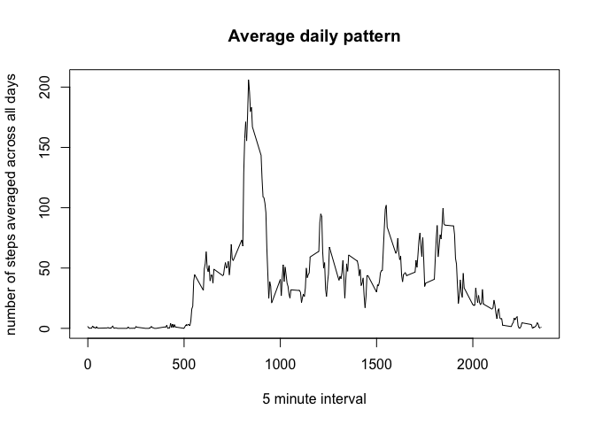

# Reproducible Research: Peer Assessment 1


## Loading and preprocessing the data
Data is available in a CSV file named 'activity'. Before loading the file, it is useful to check if the file is present in the directory. The following code checks the file exists, and loads it. If it does not exist, the code stop and exits.

```r
# make sure file exists in directory
file <- "activity.csv"
if(!file.exists(file))
  stop("Could not find file 'activity.csv'")
activity <- read.csv(file, na.strings = "NA")
```

The dataset has the following variables:
- **steps**: Number of steps taking in a 5-minute interval (missing values are coded as NA)
- **date**: The date on which the measurement was taken in YYYY-MM-DD format
- **interval**: Identifier for the 5-minute interval in which measurement was taken

With the data loaded, let us have an idea of how it looks like

```r
str(activity)
```

```
## 'data.frame':	17568 obs. of  3 variables:
##  $ steps   : int  NA NA NA NA NA NA NA NA NA NA ...
##  $ date    : Factor w/ 61 levels "2012-10-01","2012-10-02",..: 1 1 1 1 1 1 1 1 1 1 ...
##  $ interval: int  0 5 10 15 20 25 30 35 40 45 ...
```

Since we can see there are some NA values, let us remove them from the dataset

```r
cured <- activity[!is.na(activity$steps),]
```

We now have two datasets, identical, one **with** NAs and the other **without**.

## What is mean total number of steps taken per day?
Let us calculate the total number of steps taken per day, and plot it as an histogram

```r
totalperday <- aggregate(cured$steps, by=list(cured$date), FUN="sum", na.rm=T)
hist(totalperday$x, xlab="Number of steps", main="Total number of steps taken each day")
```

 

What are the mean and median of the total number of steps?

```r
mean <- mean(totalperday$x)
median <- median(totalperday$x)
```
We can see that the median is 10765.00 and the mean is 10766.19

## What is the average daily activity pattern?

The average daily pattern can be observed by plotting the average number of steps in each interval, average across all days:

```r
library(dplyr)
```

```
## 
## Attaching package: 'dplyr'
## 
## The following object is masked from 'package:stats':
## 
##     filter
## 
## The following objects are masked from 'package:base':
## 
##     intersect, setdiff, setequal, union
```

```r
intervalsteps <- activity %>%
  group_by(interval) %>%
  summarise(avgsteps = mean(steps, na.rm=T))
plot(intervalsteps$interval, intervalsteps$avgsteps,
    type="l", main="Average daily pattern",
    xlab="5 minute interval",
    ylab="number of steps averaged across all days")
```

 

```r
maxsteps <- filter(intervalsteps, avgsteps == max(intervalsteps$avgsteps))
```

We can see there is a big increase in average steps at a certain interval - but which one?

```r
maxsteps <- filter(intervalsteps, avgsteps == max(intervalsteps$avgsteps))
```
Now we can safely say the interval with highest number of steps is 835


## Imputing missing values


## Are there differences in activity patterns between weekdays and weekends?
