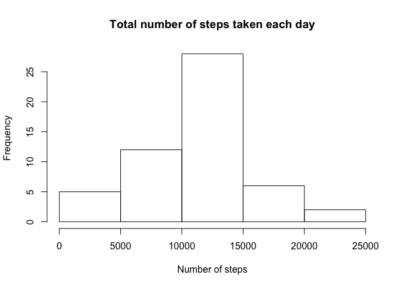
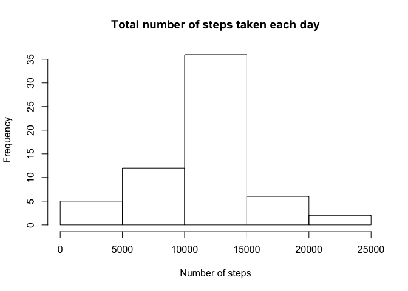
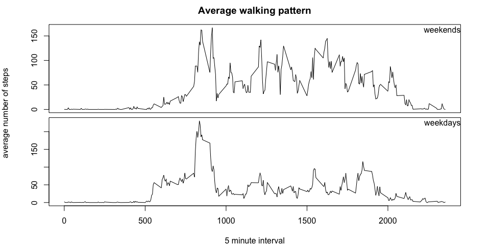

# Reproducible Research: Peer Assessment 1


## Loading and preprocessing the data
Data is available in a CSV file named 'activity'. Before loading the file, it is useful to check if the file is present in the directory. The following code checks the file exists, and loads it. If it does not exist, the code stop and exits.

```r
# make sure file exists in directory
file <- "activity.csv"
if(!file.exists(file))
  stop("Could not find file 'activity.csv'")
activity <- read.csv(file, na.strings = "NA")
```

The dataset has the following variables:
- **steps**: Number of steps taking in a 5-minute interval (missing values are coded as NA)
- **date**: The date on which the measurement was taken in YYYY-MM-DD format
- **interval**: Identifier for the 5-minute interval in which measurement was taken

With the data loaded, let us have an idea of how it looks like

```r
str(activity)
```

```
## 'data.frame':	17568 obs. of  3 variables:
##  $ steps   : int  NA NA NA NA NA NA NA NA NA NA ...
##  $ date    : Factor w/ 61 levels "2012-10-01","2012-10-02",..: 1 1 1 1 1 1 1 1 1 1 ...
##  $ interval: int  0 5 10 15 20 25 30 35 40 45 ...
```

Since we can see there are some NA values, let us remove them from the dataset

```r
cured <- activity[!is.na(activity$steps),]
```

We now have two datasets, identical, one **with** NAs and the other **without**.

## What is mean total number of steps taken per day?
Let us calculate the total number of steps taken per day, and plot it as an histogram. We shall use a function in this instance, as we will want to reuse this calculation again

```r
totaldaycalcs <- function(df) {
  totalperday <- aggregate(df$steps, by=list(df$date), FUN="sum", na.rm=T)
  hist(totalperday$x, xlab="Number of steps", main="Total number of steps taken each day")
  list(mean = mean(totalperday$x), median = median(totalperday$x))
}
```

Now it can be used as such:

```r
histocured <- totaldaycalcs(cured)
```

 

We can see that the median is 10765 and the mean is 1.0766189\times 10^{4}

## What is the average daily activity pattern?

The average daily pattern can be observed by plotting the average number of steps in each interval, average across all days:

```r
library(dplyr)
```

```
## 
## Attaching package: 'dplyr'
## 
## The following object is masked from 'package:stats':
## 
##     filter
## 
## The following objects are masked from 'package:base':
## 
##     intersect, setdiff, setequal, union
```

```r
intervalsteps <- activity %>%
  group_by(interval) %>%
  summarise(avgsteps = mean(steps, na.rm=T))
plot(intervalsteps$interval, intervalsteps$avgsteps,
    type="l", main="Average daily pattern",
    xlab="5 minute interval",
    ylab="number of steps averaged across all days")
```

 

We can see there is a big increase in average steps at a certain interval - but which one?

```r
maxsteps <- filter(intervalsteps, avgsteps == max(intervalsteps$avgsteps))
```

Now we can safely say the interval with highest number of steps is 835

## Imputing missing values
Calculating the number of rows with missing data (NAs)

```r
incompletes <- is.na(activity)
length(activity[incompletes])
```

```
## [1] 2304
```


There are 2304 rows out of 3 with NAs.

To fill in the NAs with the average steps for the corresponding interval, we can use the average calculated in 'intervalsteps' above:

```r
newactivity = activity %>%
  mutate(steps = replace(activity$steps, is.na(activity$steps), intervalsteps$avgsteps))
```

To create a histogram of the total steps taken each day, we can use the function defined above

```r
histonewactivity <- totaldaycalcs(newactivity)
```

 

For the dataset with the filled in NAs, the mean is 10766.19 (the previous value was 10766.19) and the median is 10766.19 (previous was 10765.00. This seems to indicate the strategy followed has little impact on the data distribution.

## Are there differences in activity patterns between weekdays and weekends?
For this section, we will create an extra column to label the date as a weekend or weekday, and we will be using the dataset with the filled in NAs (from before)

```r
newactivity$day <- weekdays(strptime(newactivity$date, "%Y-%m-%d", tz="UTC"))
newactivity = newactivity %>%
  mutate(day = ifelse((day == "Sunday" | day == "Saturday"),"weekend", "weekday"))
```

To generate the plots, we can use the base system, splitting the data generated above into two datasets

```r
twogroup <- newactivity %>%
  group_by(day, interval) %>%
  summarise(avgsteps = mean(steps))
weekdays <- twogroup[(twogroup$day == "weekday"),]
weekend <- twogroup[(twogroup$day == "weekend"),]
```


```r
par(mfrow = c(2,1), oma=c(4,4,2,2), mar=c(0,1,0.5,1))
# plotting weekends data
plot(weekend$interval, weekend$avgsteps, type="l", xlab="", ylab="", xaxt='n', ann=FALSE)
mtext("weekends", side=3, line=-1, adj=1)
# plotting weekdays data
plot(weekdays$interval, weekdays$avgsteps, type="l", xlab="", ylab="")
# plot annotation
mtext("weekdays", side=3, line=-1, adj=1)
title(main="Average walking pattern",outer=TRUE,
      xlab="5 minute interval", ylab="average number of steps",)
```

 
